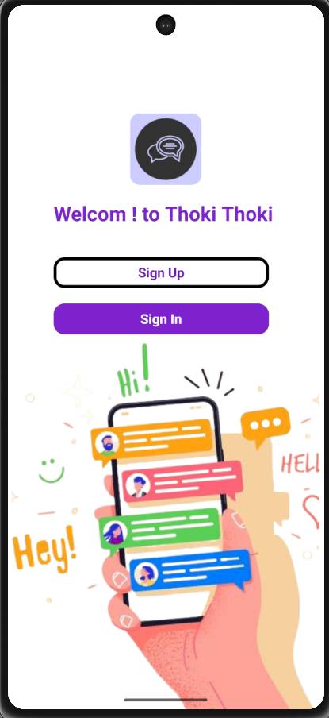
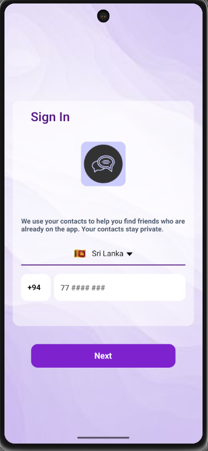
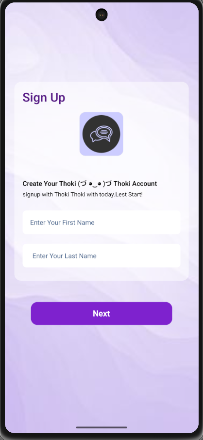
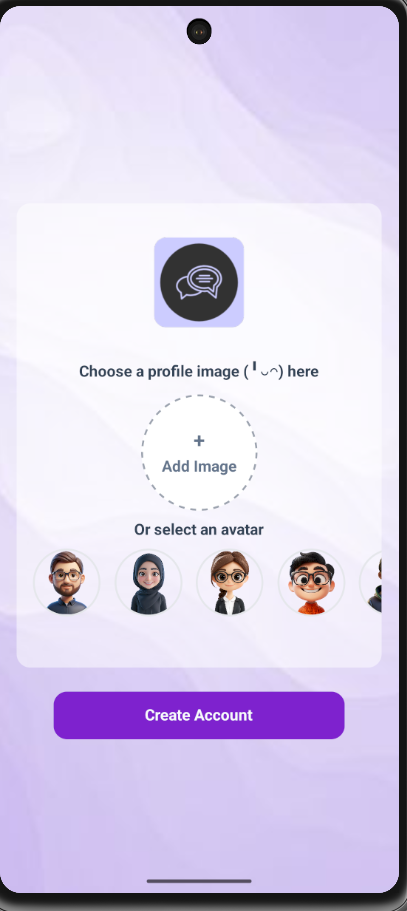
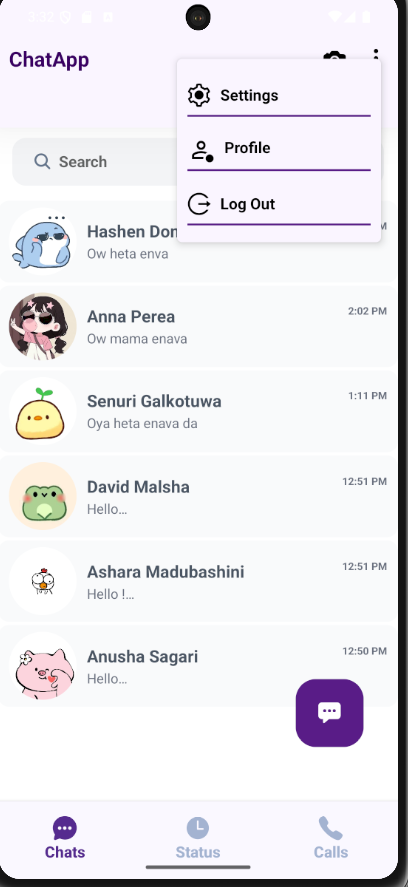
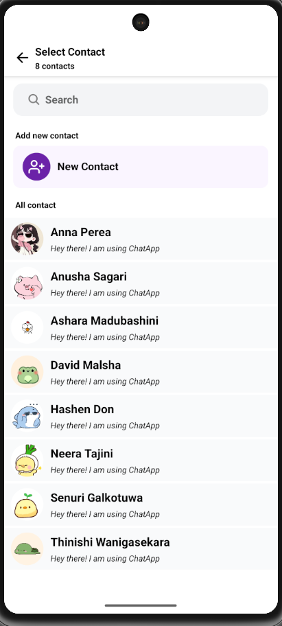
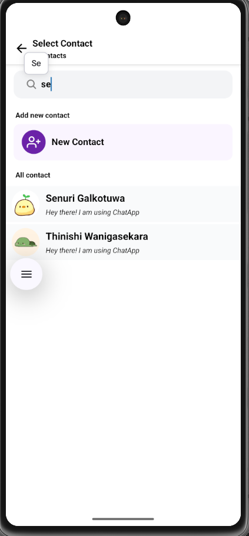
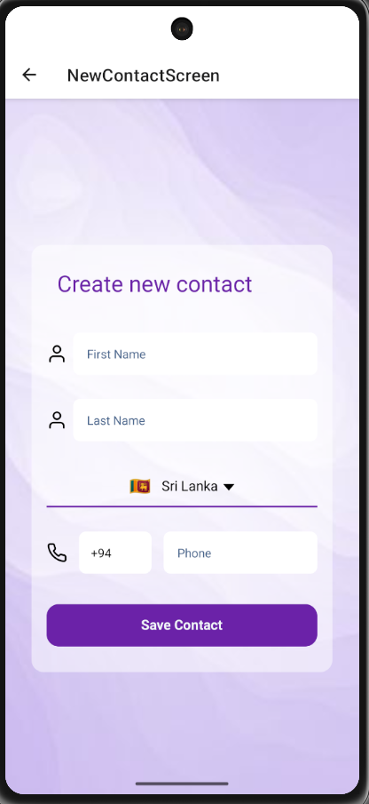
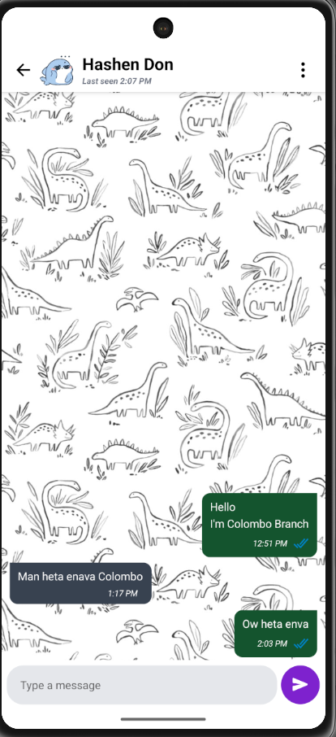
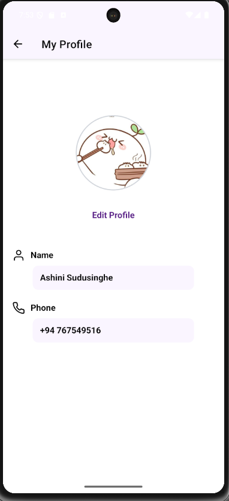

# 🚀 Real-Time Chat Application Workspace

Welcome to the **Real-Time Chat Application** workspace! 

This repository contains a full-stack real-time chat application split into two main components: a robust **Java EE Backend** and a modern **React Native Mobile Frontend** powered by Expo.

---

## 🔍 Project Architecture

We have verified the directory contents. Yes! This folder is structured into a dedicated **Frontend** and **Backend** as described below:

| Directory | Role | Core Technologies | Details |
| :--- | :--- | :--- | :--- |
| **`ChatApp/`** (Backend) | API Server & WebSocket Hub | Java, Jakarta EE, Hibernate ORM, WebSocket (`@ServerEndpoint`), GSON, MySQL | Manages database transactions, user authentication, and coordinates real-time message relays. |
| **`thoki/`** (Frontend) | Mobile Application | React Native, Expo Go, TypeScript, NativeWind (TailwindCSS), React Navigation | Modern UI with splash, login, chats list, profiles, custom avatars, settings, and interactive real-time messaging. |

---

## 📁 Workspace Directory Structure

Below is the directory tree showing the organization of the frontend and backend projects:

```
hddp/ (Workspace Root)
├── ChatApp/                  # Java EE Backend (NetBeans Project)
│   ├── lib/                  # External jar dependencies (Hibernate, MySQL, GSON, etc.)
│   ├── nbproject/            # NetBeans project configuration
│   ├── src/                  # Java source files
│   │   └── java/             
│   │       ├── conf/         
│   │       ├── controller/   # Servlets for Sign-In, Sign-Up, Profile
│   │       ├── dto/          # Data Transfer Objects
│   │       ├── entity/       # Hibernate Entity mappings (User, Chat, FriendList)
│   │       ├── socket/       # WebSocket Endpoint & Services (Real-time Messaging)
│   │       └── util/         # Hibernate Session Utility
│   ├── test/                 # Test directory
│   ├── web/                  # Web resources (index.html, profile-images/, WEB-INF/)
│   └── build.xml             # Ant build script
│
├── thoki/                    # React Native / Expo Frontend Mobile App
│   ├── .expo/                # Expo build and cache config
│   ├── assets/               # App icons, splash screens, and images
│   ├── src/                  # App screens and components
│   │   ├── components/       # AuthProvider, UserContext, and UI components
│   │   ├── screens/          # SplashScreen, HomeScreen, SingleChatScreen, ProfileScreen, SettingsScreen, etc.
│   │   ├── socket/           # WebSocketProvider and real-time hook listeners
│   │   └── theme/            # Theme provider for light/dark mode styling
│   ├── App.tsx               # Main application navigation wrapper
│   ├── app.json              # Expo application metadata configuration
│   ├── package.json          # Node dependencies and npm scripts
│   ├── tailwind.config.js    # TailwindCSS styling configuration
│   └── tsconfig.json         # TypeScript configuration
│
└── docs/
    └── images/               # Application UI screenshots referenced in README
```

---

## 📱 App Screenshots

Here is a visual walk-through of the mobile application interface, organized by user flow:

### 1. Onboarding & Registration Flow
<table style="width: 100%; border-collapse: collapse; border: none;">
  <tr style="border: none;">
    <td align="center" style="width: 25%; border: none; padding: 5px;">
      <b>Welcome Screen</b><br/>
      
    </td>
    <td align="center" style="width: 25%; border: none; padding: 5px;">
      <b>Sign In Screen</b><br/>
      
    </td>
    <td align="center" style="width: 25%; border: none; padding: 5px;">
      <b>Sign Up (Name)</b><br/>
      
    </td>
    <td align="center" style="width: 25%; border: none; padding: 5px;">
      <b>Avatar Selection</b><br/>
      
    </td>
  </tr>
</table>

### 2. Contacts & Chats Management
<table style="width: 100%; border-collapse: collapse; border: none;">
  <tr style="border: none;">
    <td align="center" style="width: 25%; border: none; padding: 5px;">
      <b>Chats List & Menu</b><br/>
      
    </td>
    <td align="center" style="width: 25%; border: none; padding: 5px;">
      <b>Select Contact</b><br/>
      
    </td>
    <td align="center" style="width: 25%; border: none; padding: 5px;">
      <b>Search Contact</b><br/>
      
    </td>
    <td align="center" style="width: 25%; border: none; padding: 5px;">
      <b>Create Contact</b><br/>
      
    </td>
  </tr>
</table>

### 3. Active Chat & Profile
<table style="width: 100%; border-collapse: collapse; border: none;">
  <tr style="border: none;">
    <td align="center" style="width: 50%; border: none; padding: 5px;">
      <b>Active Chat Screen</b><br/>
      
    </td>
    <td align="center" style="width: 50%; border: none; padding: 5px;">
      <b>My Profile Screen</b><br/>
      
    </td>
  </tr>
</table>

---

## ✨ Features

*   **Real-time Messaging**: Instant message delivery and status tracking (Sent, Delivered, Read) powered by native WebSockets.
*   **User Management**: Complete user registration (Sign-up) and login (Sign-in) flows with custom avatars and country codes.
*   **Contacts Directory**: Search and add friends to maintain a personal active chat list.
*   **Aesthetic Styling**: Sleek visual elements built with NativeWind (TailwindCSS) supporting themes and premium UI alerts.
*   **Automated Timestamps**: Created and updated timestamps automatically tracked through Hibernate lifecycle listeners (`PrePersist`/`PreUpdate`).

---

## 🗄️ Database Setup

The backend uses **MySQL** as its database engine. Follow these steps to configure your database:

### 1. Create Database Schema
Execute the following DDL script in your MySQL server (via MySQL Workbench, Command Line, or phpMyAdmin) to set up the necessary tables and relationships:

```sql
-- 1. Create the database
CREATE DATABASE IF NOT EXISTS chat_app;
USE chat_app;

-- 2. Create the User table
CREATE TABLE IF NOT EXISTS `user` (
    `id` INT AUTO_INCREMENT PRIMARY KEY,
    `first_name` VARCHAR(45) NOT NULL,
    `last_name` VARCHAR(45) NOT NULL,
    `country_code` VARCHAR(5) NOT NULL,
    `contact_no` VARCHAR(45) NOT NULL UNIQUE,
    `status` VARCHAR(45) DEFAULT 'ONLINE',
    `created_at` DATETIME NULL,
    `updated_at` DATETIME NULL
) ENGINE=InnoDB DEFAULT CHARSET=utf8mb4;

-- 3. Create the Friend List table
CREATE TABLE IF NOT EXISTS `friend_list` (
    `id` INT AUTO_INCREMENT PRIMARY KEY,
    `user_id` INT NOT NULL,
    `friend_id` INT NOT NULL,
    `user_status` VARCHAR(30) DEFAULT 'ACTIVE',
    `display_name` VARCHAR(100) NULL,
    CONSTRAINT `fk_friend_user` FOREIGN KEY (`user_id`) REFERENCES `user` (`id`) ON DELETE CASCADE,
    CONSTRAINT `fk_friend_friend` FOREIGN KEY (`friend_id`) REFERENCES `user` (`id`) ON DELETE CASCADE
) ENGINE=InnoDB DEFAULT CHARSET=utf8mb4;

-- 4. Create the Chat (Messages) table
CREATE TABLE IF NOT EXISTS `chat` (
    `id` INT AUTO_INCREMENT PRIMARY KEY,
    `from_user` INT NOT NULL,
    `to_user` INT NOT NULL,
    `message` LONGTEXT NOT NULL,
    `files` LONGTEXT NOT NULL,
    `status` VARCHAR(30) DEFAULT 'SENT',
    `created_at` DATETIME NULL,
    `updated_at` DATETIME NULL,
    CONSTRAINT `fk_chat_from` FOREIGN KEY (`from_user`) REFERENCES `user` (`id`) ON DELETE CASCADE,
    CONSTRAINT `fk_chat_to` FOREIGN KEY (`to_user`) REFERENCES `user` (`id`) ON DELETE CASCADE
) ENGINE=InnoDB DEFAULT CHARSET=utf8mb4;
```

### 2. Configure Backend Credentials
Open the Hibernate configuration file at `ChatApp/src/java/hibernate.cfg.xml` and make sure the connection URL, username, and password match your local MySQL configuration:

```xml
<property name="hibernate.connection.url">jdbc:mysql://localhost:3306/chat_app?useSSL=false&amp;allowPublicKeyRetrieval=true</property>
<property name="hibernate.connection.username">root</property>
-- Update this password to your local MySQL password --
<property name="hibernate.connection.password">YOUR_MYSQL_PASSWORD</property>
```

> [!NOTE]
> The default configuration currently points to database password: `AMS#2004681anusha`

---

## 💻 Backend Setup & Run Guide (`ChatApp/` - Java Server)

### Prerequisites:
1.  **JDK**: Java Development Kit 8 or 17 (recommended).
2.  **IDE**: NetBeans IDE (recommended, as the project contains a pre-configured NetBeans project template).
3.  **Application Server**: Apache Tomcat or TomEE / GlassFish configured in your IDE.
4.  **MySQL Server**: Running locally.

### Steps to Run:
1.  Open **NetBeans IDE**.
2.  Go to `File -> Open Project` and choose the **`ChatApp`** directory.
3.  Ensure the external libraries loaded inside the `lib/` directory are correctly resolved (they are already included in the workspace).
4.  Right-click on the `ChatApp` project node in NetBeans and select **Clean and Build**.
5.  Right-click and select **Run**. NetBeans will deploy the application to your local application server (e.g. Apache Tomcat).
6.  The backend server will deploy locally (usually on `http://localhost:8080/ChatApp`).

---

## 📱 Frontend Setup & Run Guide (`thoki/` - React Native Mobile)

### Prerequisites:
1.  **Node.js**: Version 18.x or 20.x installed.
2.  **Expo Go App**: Downloaded on your iOS or Android mobile device from the App Store / Google Play Store.
3.  **Ngrok** (Optional but highly recommended): Since mobile clients cannot easily access `localhost` directly, you can tunnel your local server using ngrok to allow external connections from Expo Go.

### Steps to Run:
1.  Open your terminal/command prompt and navigate to the frontend folder:
    ```bash
    cd thoki
    ```
2.  Install the required dependencies:
    ```bash
    npm install
    ```
3.  Configure your local environment variables in `thoki/.env`. Since the mobile app runs on your physical device, it must connect to your computer's local IP or an ngrok secure tunnel:
    ```env
    EXPO_PUBLIC_APP_OWNER=Ashini Meurika Sudusingha
    EXPO_PUBLIC_APP_VERSION=1.0
    # Replace with your local IP (e.g., http://192.168.1.100:8080/ChatApp) or ngrok URL
    EXPO_PUBLIC_APP_URL=https://59b3c36c2215.ngrok-free.app
    EXPO_PUBLIC_WS_URL=59b3c36c2215.ngrok-free.app
    ```
4.  Start the Expo development server:
    ```bash
    npm start
    ```
5.  Scan the QR code displayed in your terminal using the **Expo Go** app on Android or your camera app on iOS (with Expo Go installed).

---

## 🔌 Connection & Real-time Synchronization

*   **REST Calls**: Sign-in, Sign-up, Profile updates, and search operations are routed to the servlets inside `controller/*` (e.g. `UserController`, `ProfileController`).
*   **WebSockets**: Real-time chats are routed using the Java WebSocket endpoint `@ServerEndpoint("/socket/{userId}")` inside `socket/ChatEndPoint.java`. The React Native frontend connects to this endpoint automatically upon login to start receiving messages dynamically!

---

> [!TIP]
> **Troubleshooting Tip**: If you get a socket timeout or a network error on your phone, ensure that both your phone and your computer are connected to the **same Wi-Fi network**, or use a tunnel like **ngrok** (`ngrok http 8080`) to expose the Tomcat local port to the internet. Update the `thoki/.env` file accordingly with the new URL.

---
*Created with ❤️ for Ashini Meurika Sudusingha's Chat Application Project.*
